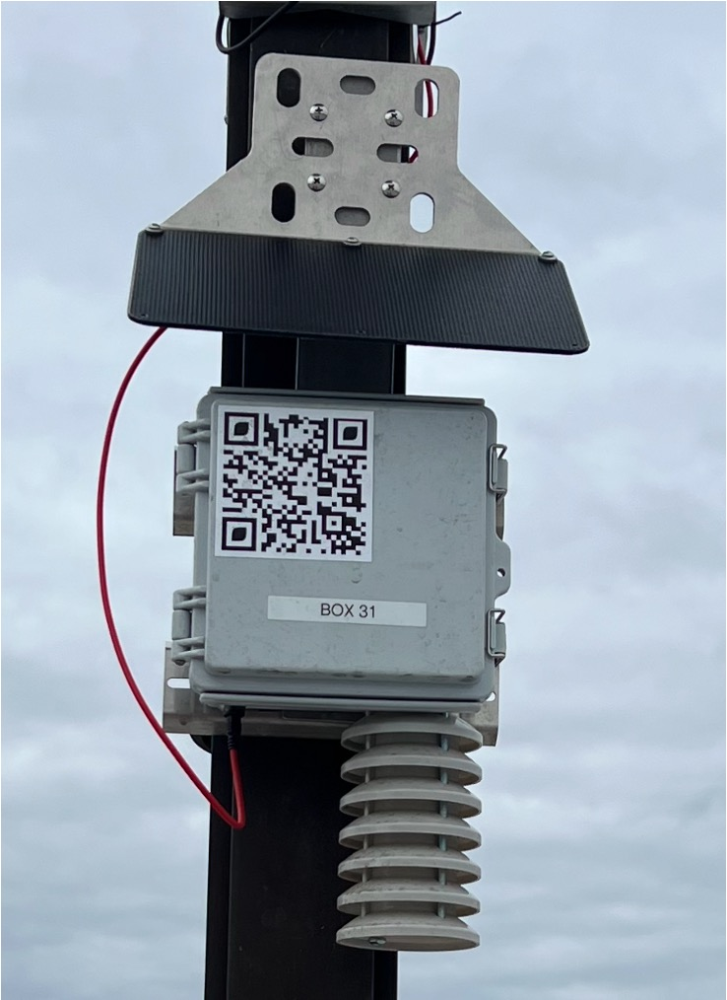

# Urban Sensor Box – Build Guide

---

This sensor box was built at the [Environmental Sensing Laboratory](https://envsensorslab.sites.northeastern.edu/) at Northeastern University as part of the [Common Senses Project](https://www.commonsensesproject.org/).

This guide is authored and maintained by **Kriish Hate**.

---

## What is this?

The Urban Sensor Box is a solar-powered environmental monitor designed for deployment on city infrastructure. It measures three things:

- **Air temperature** — ±0.5°C accuracy
- **Relative humidity** — ±3% RH accuracy
- **Noise levels** — ±1.5 dB accuracy

Readings are taken every **minute** and uploaded to the cloud every **15 minutes** over LTE. Data is also logged locally to an SD card as a backup. The system runs off a 5W solar panel and a 48Wh battery, housed in an IP67-rated enclosure, and mounts to any city pole using hose clamps. Total parts cost: under **$500 per unit**.

For full technical details, refer to the accompanying [thesis](https://hdl.handle.net/2047/D20859626): 
Hate, K. *Design of an Affordable Heat and Noise Monitoring Sensor Box for Cities.* Northeastern University, 2026. 

---

## Why does it matter?

Cities lack the monitoring density needed to identify localized environmental hazards. This box was developed as part of an NSF-funded initiative to address that gap — enabling neighborhood-scale data collection at a cost and form factor that makes wide deployment practical.

55 units were manufactured and deployed across Boston. The data is live and publicly accessible.

- Learn more: [commonsensesproject.org](https://www.commonsensesproject.org/)
- Live sensor data: [commonsensesproject.org/live-sensor-data](https://www.commonsensesproject.org/live-sensor-data)

---

Ready to build one? Start with the **[Bill of Materials](bom.md)**.